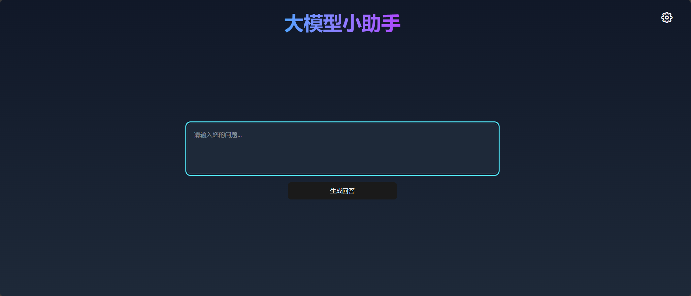
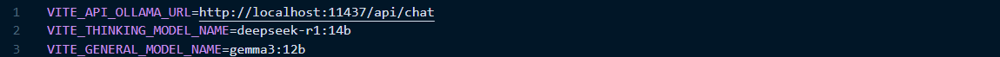
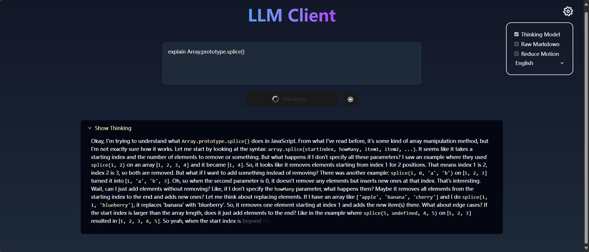
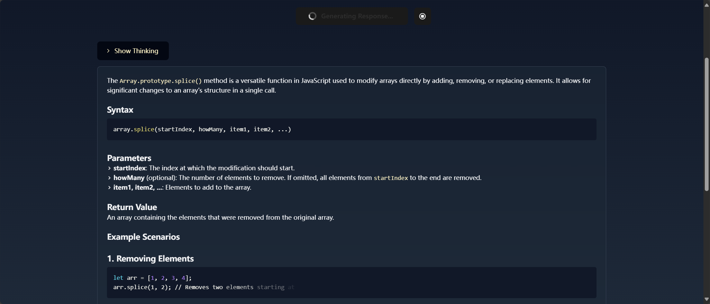

# LLM Client（大模型小助手）🤖

**An ultra-simplistic, completely local, npm-based Ollama web interface developed with user experience in mind.**
**极简 Ollama 本地网页端 UI**

> [!TIP]  
> This project is still under development, and is meant to serve as a early-stage side-project for [Wanli-Go/Project-HILLM](https://github.com/Wanli-Go/Project-HILLM).

## Features（功能）

- **Ease of use**: clone the repo, run `npm install`, and run `npm run dev` to immediately use with your Ollama.
  - robust support for DeepSeek thinking models. （完全支持DeepSeek思考模式）
- **Simplistic, Satisfactory UI**: minimal configuration; strong focus on visual fluidness (with an option to reduce motion).
- **Accessibility:** use keyboard to navigate intuitively.
  - Press `Tab` to navigate between buttons.
  - Press `Ctrl + L` to open Settings.
- **Lightweight**: minimal dependencies (basic `vite` + `React` + `Typescript` + small packages like `prism.js` and `primeicons`)
  - Custom-written markdown renderer.
- **Language Support**: Chinese first, English second.（中文优先）

Give a star or make PRs if you like it!

## Installation（安装）

***TL;DR**: pull models -> clone repo -> check out `.env` -> run `npm run dev`* 

- Install **Ollama** and **Node.js**, if you haven't already. （安装Ollama和Node.JS）

  - Ollama 是一个在本地部署大模型的简单程序。
  - Node.js 是一个 JavaScript 运行时。

- Use Ollama to pull at least 1 **DeepSeek model** and 1 **non-thinking model**. （用Ollama获取至少一个DeepSeek模型和一个非思考模型）

  - [deepseek-r1](https://ollama.com/library/deepseek-r1)
  - 非思考模型，如 [qwen2.5](https://ollama.com/library/qwen2.5) （通义千问2.5）

- Clone the repo, navigate to project's folder, and run `npm install`. （克隆本仓库，在命令行上进入这个项目的目录，然后运行安装指令 `npm install`）

- Configure `.env`: （设置项目环境变量）

  

  - `VITE_API_OLLAMA_URL`：Ollama 对话接口（默认为`http://localhost:11434/api/chat`）
  - `VITE_THINKING_MODEL_NAME`：Ollama官方模型名称（DeepSeek）
  - `VITE_GENERAL_MODEL_NAME`：Ollama官方非思考模型名称

- run `npm run dev`. （在项目目录的命令行上运行命令启动程序）

- Happy Hacking!

## Tips

- The project is still in her early stages.
- You can view the request body in browser's console every time you make a request.
- When you press the Regenerate button, it will use the input field's latest value, not last request's value.

## Showcase

